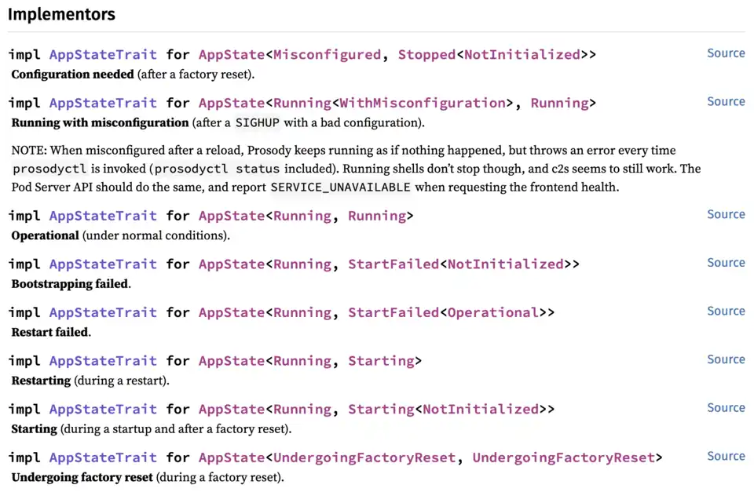

# Implementing a web API as a state machine

## Introduction

[State machines] can be mentally modeled as a graph made of states and
transitions. Both states an transitions hold data, as some might be necessary
to create the destination state when transitioning.

Before reading this, you should definitely start with [`ARCHITECTURE.md`] to
understand the context around this document. As a quick reminder if you read it
some time ago, the Prose Pod Server orchestrates a XMPP server and exposes
routes to configure it. Depending on the state the XMPP server is in (stopped,
running…), the Prose Pod Server API serves a different set of routes. Also, the
Prose Pod Server can be configured and reloaded, which means the Server API
has to handle a combination of `n*m` possible states. To make it easier to
reason with, we designed a state machine which allows us to only have to handle
the meaningful state combinations.

## State diagram

Here is a semi-formal state diagram of the Prose Pod Server API:


## Implementing the state machine

### Dynamic router

[`axum::serve`] consumes `Router`s, which means we cannot change the `Router`
at runtime without downtime. [`axum::Router::with_state`] consumes state, which
means we cannot mutate the state either. We could have interior mutability, but
that wouldn’t allow us to expose different routes based on the state.
Workarounds could be possible, but it would be verbose and error-prone.

Thankfully, there is a trick. [`axum::Router::fallback_service`] takes a
[`tower::Service`] generic over [`axum::extract::Request`], and redirects all
requests which didn’t match existing routes to it. By creating our own dynamic
[`tower::Service`] which redirects requests to an internally mutable `Router`,
we can update at runtime the 

[`tower::Service::call`] needs `&mut self`, which means we need to share a
mutable `Router` across all threads. `Router`s have to implement `Clone` anyway,
so we can use `RwLock`s without having to use write-only locks to get a mutable
reference.

[`axum::Router::fallback_service`] + static routes

be called if no routes matches the incoming request

In functional programming, there is no such thing as static variables.
Functions take a value as input, and produce a new value as output.

### `AppStateTrait`

`cargo doc` then navigate to `AppStateTrait`:



### Keeping memory

Some states have a different meaning, but in reality they need to store the same
data. For example, when the backend is operational TODO

TODO: Genenics

## Naming conventions

App states and transition functions should make perfectly clear what they are
doing or representing. Just by looking at a type or function signature, one
should be able to infer what the implementation does.

Here are some conventions one should follow to keep things consistent and
follow functional programming concepts:

### `do_*` functions

`AppState` methods starting with `do_` perform transitions and log errors in
case of failures. They’re the kind of functions one would generally call. They
don’t require any extra processing: they “consume” one state, perform the
desired action in its entirety, then return the new transitioned state.

They return `Result`s where successes are one or more possible `AppState`s and
failures are one or more `FailState`s.

They can take additional arguments, like `do_stop_backend` which takes
`(self, prosody: &mut RwLockWriteGuard<'a, ProsodyChildProcess>)`.

Let’s take an example:

```rust
impl<F, B> AppState<F, B> {
    pub async fn do_factory_reset(
        self,
    ) -> Result<
        Either<
            AppState<f::Misconfigured, b::Stopped<b::NotInitialized>>,
            AppState<f::Running, b::Running>,
        >,
        Either<
            FailState<f::UndergoingFactoryReset, b::UndergoingFactoryReset>,
            FailState<f::Running, b::StartFailed<b::NotInitialized>>,
        >,
    >
    where
        F: Into<f::UndergoingFactoryReset>,
        B: Into<b::UndergoingFactoryReset> + AsRef<b::Operational> + Clone,
    {
        // ...
    }
}
```

Without even seeing the implementation, the sole function signature explicits
elmost everything the implementation will do:

1. ```rust
   impl<F, B> AppState<F, B> {
   // ...
   where
       F: Into<f::UndergoingFactoryReset>,
       B: Into<b::UndergoingFactoryReset> + AsRef<b::Operational> + Clone,
   ```

   Since `UndergoingFactoryReset` states are conceptually equivalent to the
   unit type (`()`), `Into<*::UndergoingFactoryReset>` requirements don’t
   communicate much. Same goes for `Clone`. However, `AsRef<b::Operational>`
   signals that one can perform `do_factory_reset` only if the back end is in
   some operational state —which means the Server API will likely do something
   that requires the XMPP server to be running.
1. ```rust
   Result<
       Either<
           AppState<f::Misconfigured, b::Stopped<b::NotInitialized>>,
           AppState<f::Running, b::Running>,
       >,
       Either<
           FailState<f::UndergoingFactoryReset, b::UndergoingFactoryReset>,
           FailState<f::Running, b::StartFailed<b::NotInitialized>>,
       >,
   >
   ```

   When running `do_factory_reset`, 4 things can happen:

   1. The app ends up in the “Misconfigured” state, and that is expected.
   1. The app can restart successfully after a factory reset, but that’s not
      guaranteed.
   1. The app can be stuck in the “Undergoing Factory Reset” state.
   1. The back end can fail to start.

If you look closely at the state diagram, that’s what you should see.

### `try_*` functions

Sometimes we might have two different `do_*` functions which perform the same
sub-state transition (meaning it doesn’t correcpond to a valid app state), and
we’d like to factor the logic in a single place.

In this case, we can define `try_*` functions which don’t perform transitions
nor log errors on failure, but only add debugging context to it. Such functions
must return `(Self, anyhow::Error)`, to allow one to get back ownership of the
app state and perform other actions on it in case of a failure (if needed).

One good example is:

```rust
impl<F, B> AppState<F, B>
where // ...
{
    pub(crate) fn try_reload_frontend<B2>(
        self,
    ) -> Result<AppState<f::Running, B2>, (Self, anyhow::Error)>
    where // ...
    {
        match Self::reload_frontend(&self) {
            Ok(frontend) => Ok(self.with_frontend(frontend).with_auto_transition()),

            Err(err) => {
                let error = err.context("Frontend reload failed");
                Err((self, error))
            }
        }
    }
}
```

where the corresponding `do_` function is:

```rust
// In `AppState<f::Running<FrontendSubstate>, B>`.
fn do_reload_frontend(
    self,
) -> Result<AppState<f::Running, B>, FailState<f::Running<f::WithMisconfiguration>, B>>
```

### `AppState::*(app_state: &Self)` functions

Writing `try_*` functions is good way to factor things, but because it has to
return `(Self, anyhow::Error)` in the error case, we can’t easily use the `?`
operator and implementations become very verbose. To solve this, one can write
an “atomic” function that takes a reference and returns `anyhow::Error`s
directly; such as:

```rust
// In `AppState<F, B>`.
fn reload_frontend(app_state: &Self) -> Result<f::Running, anyhow::Error>
```

Note that although the function it defined in `AppState`, it doesn’t take
`&self`. The rationale behind it is that it reduces the number of results the
language server proposes for auto-completion, and it makes it less likely for
someone to use the atomic function while they should probably use the `try_*`
or `do_*` function directly instead. It also disambiguates a bit the difference
between, say, `AppState::do_reload_frontend` and `AppState::reload_frontend`.
Having to call `state.do_reload_frontend` or `AppState::reload_frontend(&state)`
makes a clear visual difference signifying that the latter call won’t be
performing any transition (as long as we’re consistent with the naming).

One could also argue that such function could be defined as a free function,
but having it defined as a method in `AppState` avoids the need for imports
everywhere.

## Improvement ideas

- We could try to make `AppState` and/or `FailState` conform to
  `axum::response::IntoResponse` by replacing `AppState` with `()`. This would
  make route definitions trivial: a single function call without even needing a
  `match`. We would probably have to use our domain-specific `Error` type
  instead of `anyhow::Error` in `FailState` though.
- We could try to make `do_*` function implementations more “fluent” by adding
  some custom utility methods. For example,

  ```rust
  match self.try_reload_frontend() {
      Ok(new_state) => Ok(new_state),

      Err((app_state, error)) => {
          // Log debug info.
          tracing::error!("{error:?}");

          Err(app_state.transition_failed(error))
      }
  }
  ```

  could become something like:

  ```rust
  self.try_reload_frontend()
      .inspect_error(|error| tracing::error!("{error:?}"))
      .transition_failed_if_error()
  ```

  or even better, something that forces error logging like:

  ```rust
  self.try_reload_frontend()
      .transition_failed_if_error(|error| tracing::error!("{error:?}"))
  ```

[`ARCHITECTURE.md`]: ./ARCHITECTURE.md
[`axum::extract::Request`]: https://docs.rs/axum/latest/axum/extract/type.Request.html
[`axum::Router::fallback_service`]: https://docs.rs/axum/latest/axum/struct.Router.html#method.fallback_service
[`axum::Router::with_state`]: https://docs.rs/axum/latest/axum/struct.Router.html#method.with_state
[`axum::serve`]: https://docs.rs/axum/latest/axum/fn.serve.html
[`tower::Service::call`]: https://docs.rs/tower/latest/tower/trait.Service.html#tymethod.call
[`tower::Service`]: https://docs.rs/tower/latest/tower/trait.Service.html
[State machines]: https://en.wikipedia.org/wiki/Finite-state_machine "Finite-state machine - Wikipedia"
